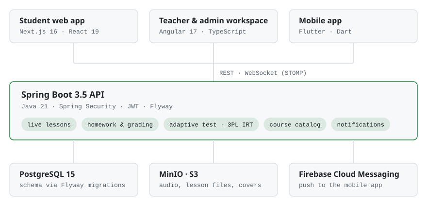

### Miras · full-stack engineer at [Just to Study](https://github.com/jtsapp)

I am building an English-learning platform end to end: live online lessons with a teacher, homework, an adaptive placement test and a course catalog from A0 to B2. My work spans all four codebases — the Spring Boot API and its migrations, the Angular workspace for teachers and admins, the Next.js student app and the Flutter mobile app. Since June 2026 that's 380+ merged pull requests.

<picture>
  <source media="(prefers-color-scheme: dark)" srcset="assets/stack-dark.svg">
  <source media="(prefers-color-scheme: light)" srcset="assets/stack-light.svg">
  
</picture>

#### Things I've built

- **Live lessons.** The lesson state lives on the server, and the teacher's pointer, current stage and scroll reach every student in real time over WebSocket.
- **Adaptive placement test.** Answers are checked on the server and each next question is picked by a 3PL item-response model, so clicking at random no longer lands you at B1.
- **Homework from any part of a lesson.** A teacher assigns a single stage or task of a live lesson, and the server grades it with the same renderer the lesson uses.

#### Stack

| Area | Tools |
|:---|:---|
| Backend | Java 21, Spring Boot 3.5, Spring Security, JWT, WebSocket / STOMP, PostgreSQL, Flyway, MinIO |
| Frontend | TypeScript, Angular 17, Next.js 16, React 19 |
| Mobile | Flutter, Dart |
| Delivery | Docker, Nginx, GitLab CI |

#### Public projects

- **[Mobile Research](https://dorhsis.github.io/travels_tralala/)** — interactive market research of English-learning apps: why users churn, which retention mechanics work, teardowns of Duolingo, Busuu, LingQ and others, and an architecture sketch. HTML, CSS, JS, Mermaid.
- **[jts-web-app](https://github.com/jtsapp/jts-web-app)** — student web app of Just to Study. Next.js, React.
- **[AI teacher prototype](https://github.com/dorhsis/Just-to-study-learning-platform-)** — early prototype of the platform: a voice AI teacher and a level test on Gemini and Firebase.
